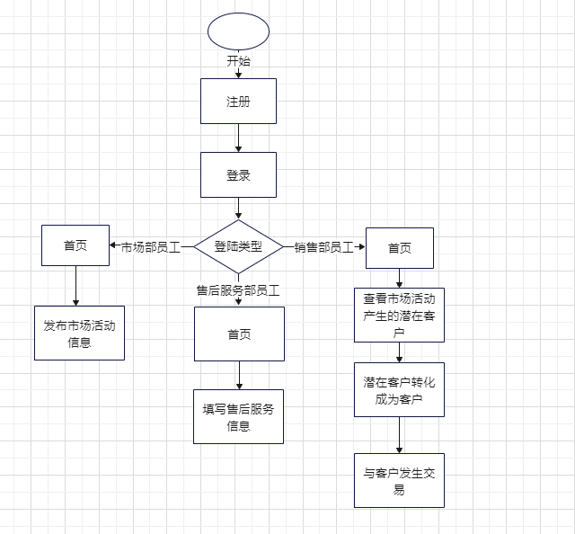
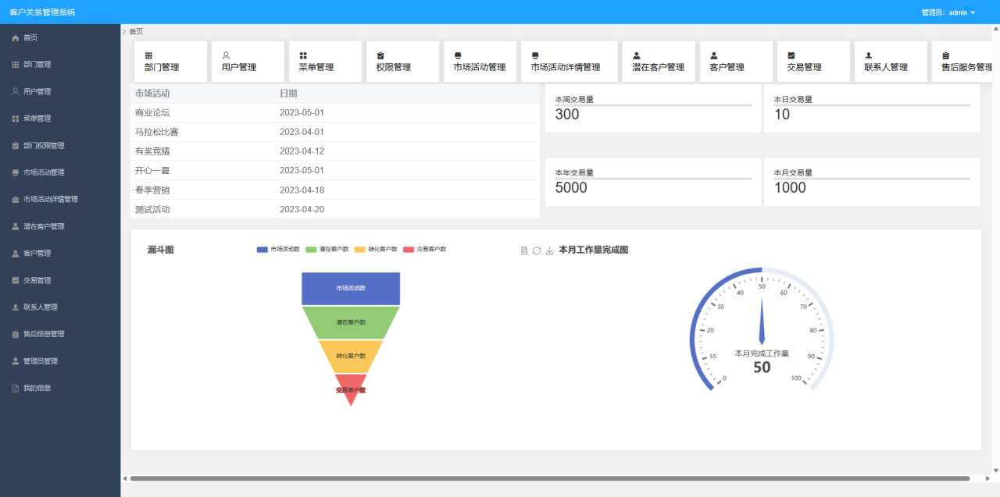
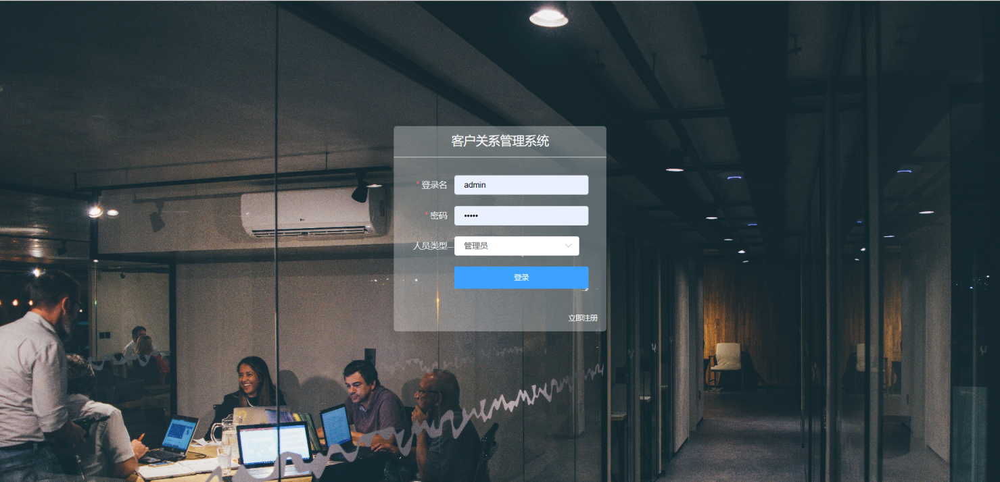
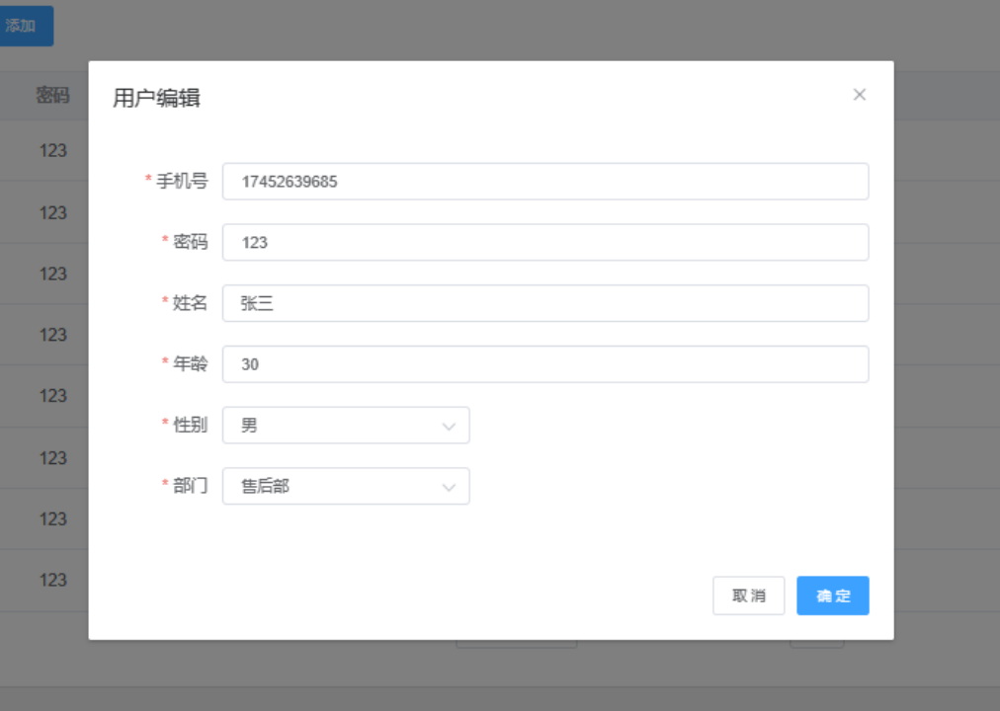
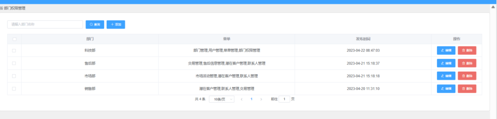
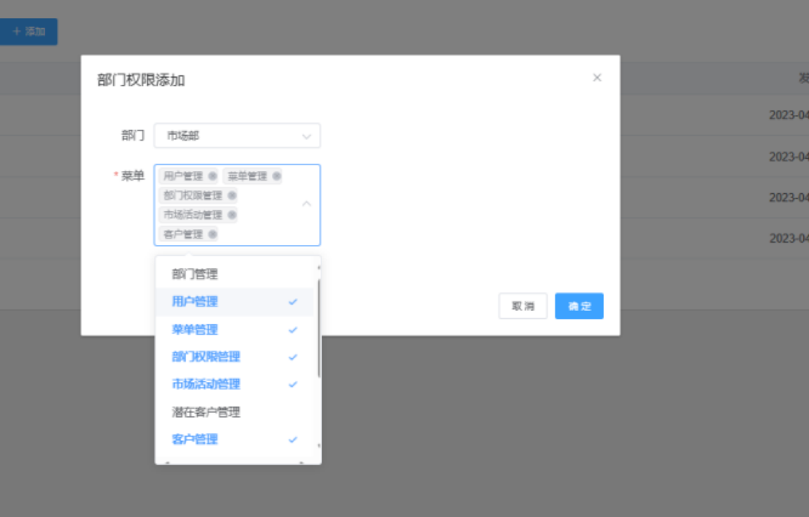

## 平台简介

该管理系统是一个crm客户管理系统，设计的功能主要包括部门管理、用户管理、菜单管理、部门权限管理、市场活动管理、潜在客户管理、客户管理、联系人管理、交易管理、售后信息管理以及管理员管理。本系统采用SSM架构，采用面向切面开发应用方法完成，包括总体设计、详细设计、编码实现、测试。在 URL 网址中输入项目名链接访问登录界面，进行管理系统账户登录，显示客户信息等相关内容。

* 采用前后端分离的模式。
* 后端采用Spring Boot、Spring、MyBatis，前端采用Vue。

## 内置功能

1.  部门管理：配置系统组织机构（公司、部门、小组），树结构展现支持数据权限。
2.  用户管理：用户是系统操作者，该功能主要完成系统用户配置。
3.  菜单管理：配置系统菜单，操作权限，按钮权限标识等。
4.  部门权限管理：部门菜单权限分配、设置角色按部门进行数据范围权限划分。
5.  市场活动管理：主要是对企业未举办的活动，计划举办的活动以及已经举办过的活动的信息进行管理。
6.  潜在客户管理：主要是对公司举办的活动中产生的潜在的客户信息进行管理。
7.  客户管理：主要是将确定会与我司合作的潜在用户转化成为客户，并且对客户的信息进行管理。
8.  联系人管理：主要是对我们的老客户的的联系方式等信息进行管理。
9.  交易管理：主要是对我司与客户之间的交易信息进行管理。
10. 售后信息管理：主要是成交后的客户使用我司产品的感受的信息进行管理。
11. 管理员管理：主要是对管理员的信息进行管理。

## 演示图

<table>
    <tr>
        <td></td>
        <td></td>
    </tr>
    <tr>
        <td></td>
        <td></td>
    </tr>
    <tr>
        <td></td>
        <td></td>
    </tr>
	<tr>
        <td></td>
        <td></td>
    </tr>	 
    <tr>
        <td></td>
        <td></td>
    </tr>
	<tr>
        <td></td>
        <td></td>
    </tr>
	<tr>
        <td></td>
        <td></td>
    </tr>
    <tr>
        <td></td>
        <td></td>
    </tr>
</table>

